#  LLM Gateway with Portkey 

> **One-line summary:** An LLM Gateway is a proxy layer that sits between your application and any LLM provider — adding resilience, observability, and cost control with zero changes to your business logic.

---

## What Is an LLM Gateway?

Imagine your application is a restaurant kitchen. The LLM is the supplier (Groq, OpenAI, NVIDIA). Without a gateway, your chef calls the supplier directly every time — and if that one supplier is out of stock, the kitchen shuts down.

An LLM Gateway is like a **purchasing manager** between the kitchen and the suppliers:

- Routes each order to the right supplier
- Automatically tries a backup supplier if the first one fails
- Logs every order for accounting
- Remembers frequently ordered items so you don't pay twice
- Enforces a time limit — if the supplier takes too long, cancel and try someone else

In software terms: **every LLM call goes through the gateway instead of the provider directly**.

```
Your App  →  [LLM Gateway]  →  Groq / NVIDIA / OpenAI / Anthropic
```

---

## Why Do We Need It?

Direct LLM calls work fine in a notebook. In production, they break:

| Problem | What Happens Without a Gateway |
| --- | --- |
| **Provider rate limit (429)** | App crashes with an error at 3 AM |
| **Provider outage** | Full downtime — no automatic recovery |
| **Slow response / stall** | FastAPI worker hangs indefinitely |
| **Same question 1000 times** | You pay for 1000 LLM calls |
| **Switch providers** | Rewrite every API call across 10+ files |
| **No audit trail** | Zero visibility — impossible to debug or bill |
| **No per-feature analytics** | No idea which part of the app costs the most |

A gateway solves all of these — **centrally, without touching business logic**.

---

## How a Request Flows Through Portkey

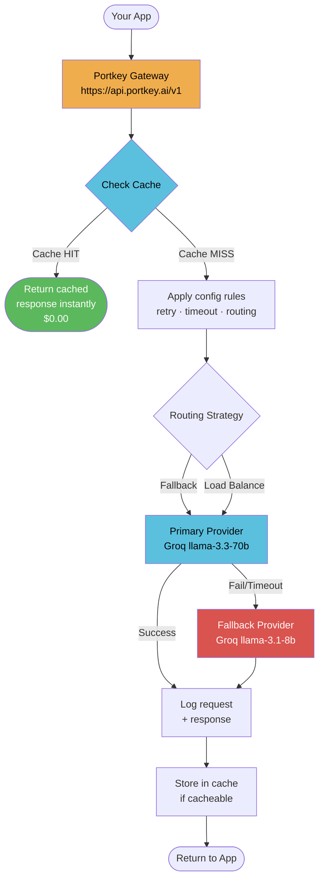

**Key insight:** Your app sends the same API call it always did. Portkey intercepts it, applies all your rules, and returns the response. The provider switch is invisible to your code.

---

## The Two Core Concepts

Before anything else, these two things look similar but are completely different:

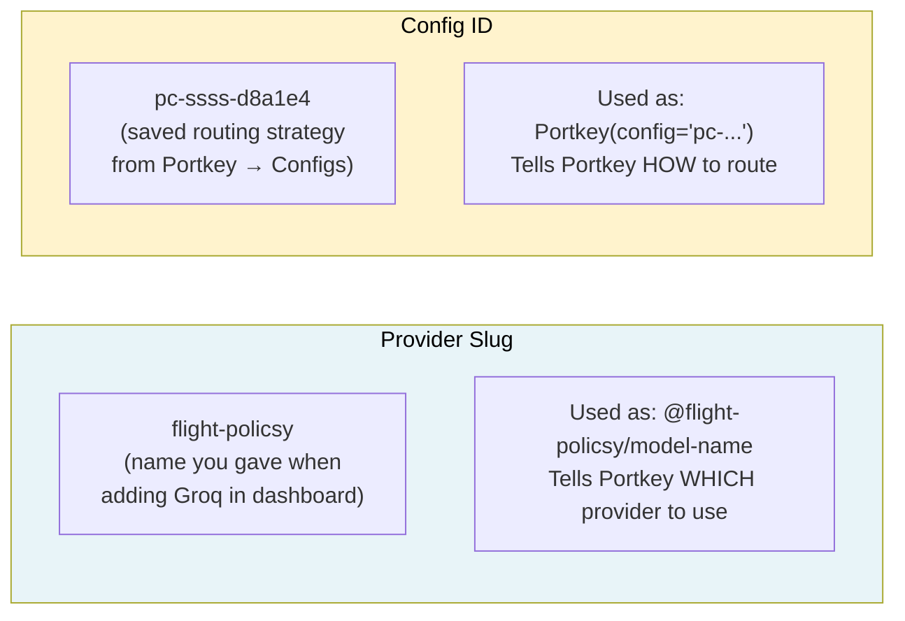

| Thing | Looks like | Answers |
| --- | --- | --- |
| **Provider slug** | `flight-policsy` | *Which provider / model?* |
| **Config ID** | `pc-ssss-d8a1e4` | *How to route, retry, cache?* |

---

## Feature 1 — Basic Routing (Observability for Free)

The simplest use: just route through Portkey. Every call is **automatically logged** in the dashboard — token count, cost, latency, full prompt and response.

```python
from portkey_ai import Portkey

portkey = Portkey(api_key=PORTKEY_API_KEY)

response = portkey.chat.completions.create(
    model="@flight-policsy/llama-3.3-70b-versatile",
    messages=[{"role": "user", "content": "What is Kubernetes?"}]
)
```

**Before vs After:**

```
Before:  Your App  →  Groq directly          (no logs, no visibility)
After:   Your App  →  Portkey  →  Groq        (full dashboard + logs)
```

You changed 3 lines. Business logic: identical.

---

## Feature 2 — Metadata & Observability

Tag every request with user, session, and feature info. Portkey uses these to power per-user analytics, cost breakdowns by feature, and session replay.

```python
response = portkey.with_options(
    metadata={
        "_user":       "alice",           # special key → per-user analytics
        "session_id":  "abc-123",
        "feature":     "enterprise-rag",
        "environment": "production"
    }
).chat.completions.create(model="@flight-policsy/...", messages=[...])
```

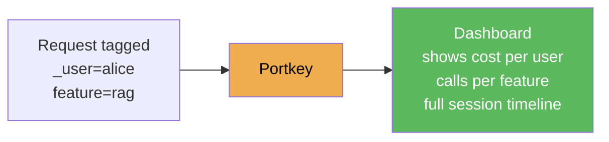

**Questions you can now answer from the dashboard — zero extra logging code:**

- Which user generates the most cost?
- Which feature uses the most tokens?
- Is the RAG pipeline slower than the support bot?

---

## Feature 3 — Automatic Retries

Pass a `config` dict to `Portkey(...)`. On a transient error (rate limit, server error), Portkey retries automatically with exponential backoff. Your app code never sees the failure.

```python
portkey = Portkey(api_key=PORTKEY_API_KEY, config={
    "retry": {
        "attempts":        3,
        "on_status_codes": [429, 500, 502, 503, 504]
    }
})
```

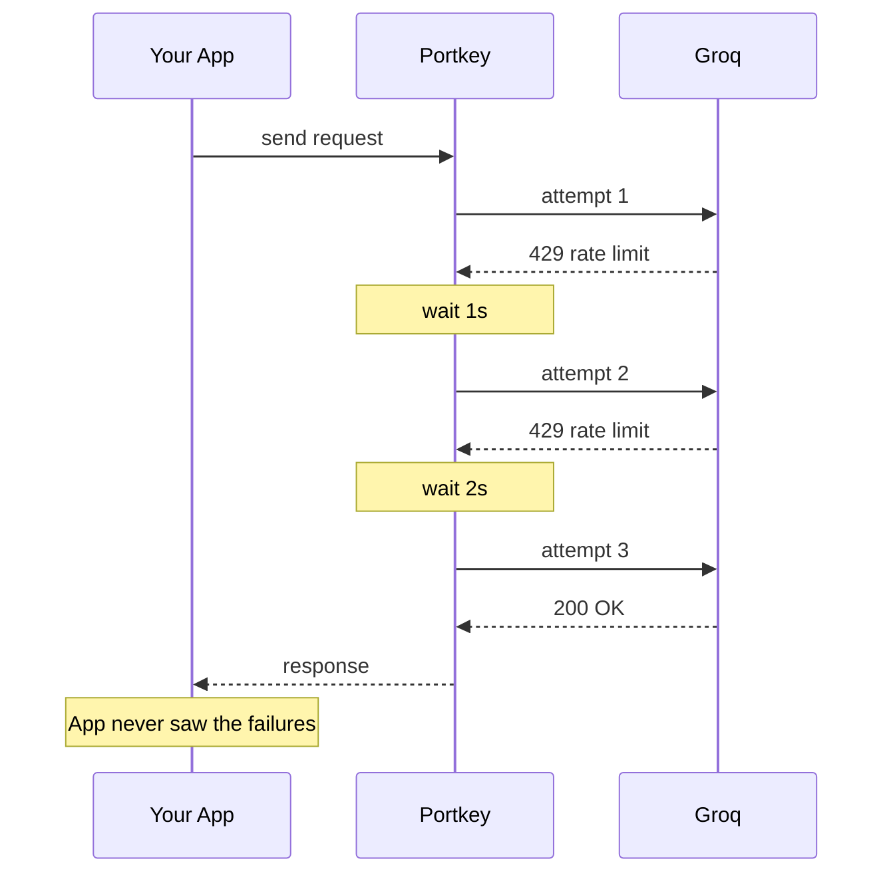

---

## Feature 4 — Request Timeouts

Set a hard time limit in milliseconds. If the LLM stalls, Portkey kills the request and returns HTTP 408. Without this, a slow Groq response blocks a FastAPI worker indefinitely.

```python
portkey = Portkey(api_key=PORTKEY_API_KEY, config={
    "request_timeout": 10000    # 10 seconds in milliseconds
})
```

**Production pattern — combine with retry:**

```python
config = {
    "request_timeout": 10000,
    "retry": {"attempts": 2, "on_status_codes": [408, 429, 503]}
}
```

Timeout fires → 408 → retry kicks in → try again. Users see a slightly slower response instead of a hang.

---

## Feature 5 — Fallbacks

If the primary model fails (any non-2xx), Portkey automatically switches to the next target in the list. Users never see the failure.

```python
portkey = Portkey(api_key=PORTKEY_API_KEY, config={
    "strategy": {"mode": "fallback"},
    "targets": [
        {"override_params": {"model": "@flight-policsy/llama-3.3-70b-versatile"}},  # primary
        {"override_params": {"model": "@flight-policy/llama-3.1-8b-instant"}}       # fallback
    ]
})
```

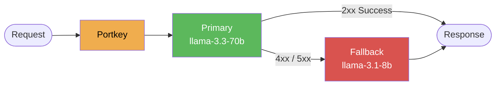

**Narrowing the trigger** (avoids fallback on bad requests):

```python
"strategy": {"mode": "fallback", "on_status_codes": [429, 503]}
```

---

## Feature 6 — Load Balancing

Split traffic between models by weight. Each request is routed probabilistically — 70% to the primary, 30% to the secondary.

```python
portkey = Portkey(api_key=PORTKEY_API_KEY, config={
    "strategy": {"mode": "loadbalance"},
    "targets": [
        {"override_params": {"model": "@flight-policsy/llama-3.3-70b-versatile"}, "weight": 0.7},
        {"override_params": {"model": "@flight-policy/llama-3.1-8b-instant"},     "weight": 0.3}
    ]
})
```

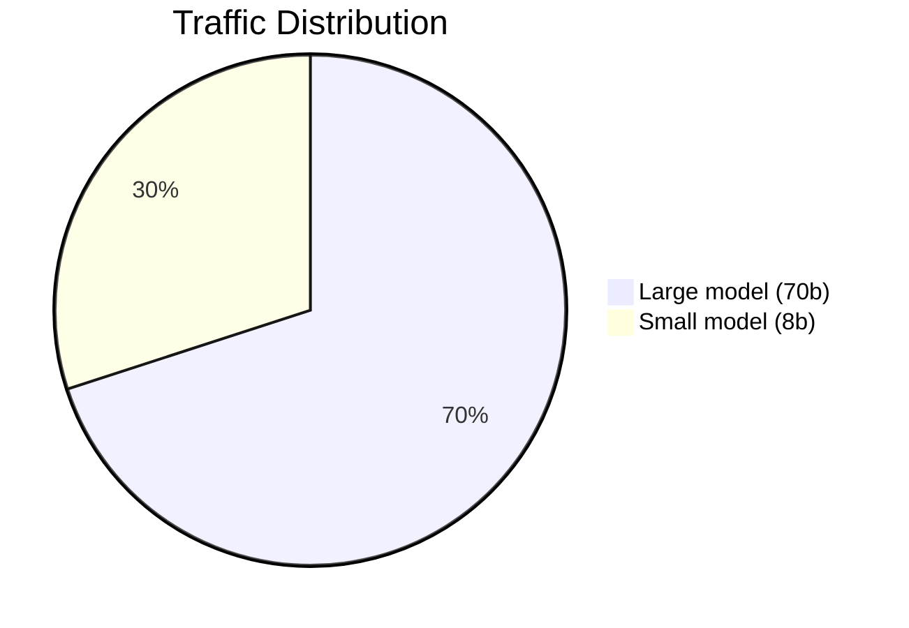

**Use cases:**

| Scenario | Config |
| --- | --- |
| **Gradual migration** | Start 95/5, shift to 0/100 over weeks |
| **A/B testing** | 50/50 — compare quality per model |
| **Cost control** | Route more traffic to the cheaper model |
| **Maintenance** | `weight: 0` pauses a target without removing it |

---

## Feature 7 — Request Caching

Portkey caches the full response for identical requests. The second call is instant and costs nothing.

```python
portkey = Portkey(api_key=PORTKEY_API_KEY, config={
    "cache": {"mode": "simple"}     # exact-match cache
})
```

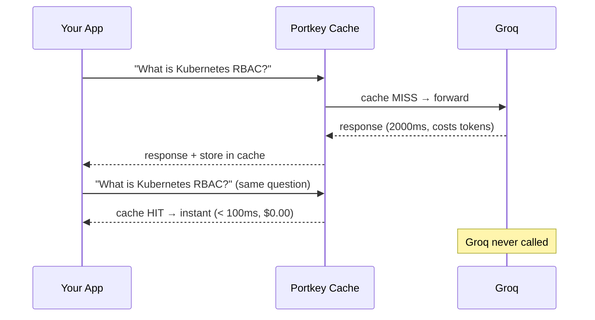

**Verify cache hit:** Portkey Logs → click any request → look for `cache_status: HIT`.

**Force a fresh response** (e.g. after updating your knowledge base):

```python
portkey.with_options(cache_force_refresh=True).chat.completions.create(...)
```

| Cache Mode | How it matches | Plan |
| --- | --- | --- |
| `simple` | Exact request match | Free / Starter |
| `semantic` | Similar meaning match | **Enterprise tier only** |

> **Semantic cache on free/starter plans:** If your Portkey account is not on Enterprise, setting `"mode": "semantic"` silently falls back to simple (exact-match) cache behaviour. No error is thrown. The code is correct to set semantic — it will upgrade automatically when the account tier changes.

---

## Feature 8 — Saved Configs from Dashboard

Build your routing strategy once in the Portkey dashboard. Save it. Reference the `pc-` ID everywhere. Update the strategy centrally — no redeployment needed.

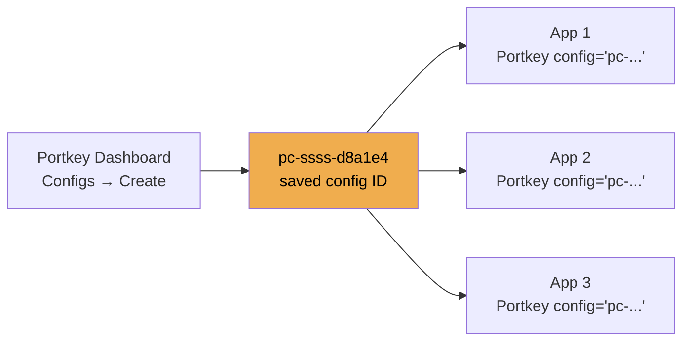

```python
portkey = Portkey(api_key=PORTKEY_API_KEY, config="pc-ssss-d8a1e4")
```

**Why this matters:** You can change the fallback order, retry counts, or timeout from the dashboard at midnight without touching code or triggering a deploy. Any app holding that config ID picks up the change instantly.

---

## Feature 9 — LangChain Drop-In

Portkey exposes an OpenAI-compatible endpoint. Swap `ChatGroq` for `ChatOpenAI` pointing at Portkey — zero changes to chain logic, prompts, or LangGraph wiring.

> **Why ChatOpenAI and not ChatGroq?**
>
> Every LLM company's API has an **address** (URL):
>
> - Groq's address: `https://api.groq.com/openai/v1`
> - Portkey's address: `https://api.portkey.ai/v1`
>
> `ChatGroq` has Groq's address **hardcoded inside it**. You cannot change where it sends requests.
>
> `ChatOpenAI` has a `base_url` parameter — it will send to **whatever address you give it**. So you point it at Portkey's address instead:
>
> ```python
> ChatOpenAI(base_url="https://api.portkey.ai/v1")  # now talking to Portkey, not OpenAI
> ```
>
> The "OpenAI" in `ChatOpenAI` doesn't mean OpenAI the company. It means **"speaks the OpenAI API format"** — which Portkey, Groq, and most modern LLM providers all do. It has become the industry-standard format. So `ChatOpenAI` is really just a flexible LLM client that speaks the standard format and lets you point it anywhere.
>
> You are still using Groq models. Portkey just sits in the middle.
>
> ```
> ChatGroq                                    →  Groq directly  (hardcoded, no Portkey)
> ChatOpenAI(base_url=PORTKEY_GATEWAY_URL)   →  Portkey  →  Groq
> ```

```python
from langchain_openai import ChatOpenAI
from portkey_ai import createHeaders, PORTKEY_GATEWAY_URL

# Before (direct Groq)
llm = ChatGroq(api_key=GROQ_API_KEY, model="llama-3.3-70b-versatile")

# After (Portkey gateway — everything else unchanged)
llm = ChatOpenAI(
    api_key=PORTKEY_API_KEY,
    base_url=PORTKEY_GATEWAY_URL,
    model="@flight-policsy/llama-3.3-70b-versatile",
    default_headers=createHeaders(
        api_key=PORTKEY_API_KEY,
        metadata={"feature": "rag-pipeline", "_user": "system"}
    )
)
```

Every LangGraph node — planner, retriever, responder — is now logged, retried, and fallback-protected without changing any node logic.

---

## Feature 10 — Streaming

Portkey passes chunks through as they arrive. All gateway features — logging, retries, fallback — still apply.

```python
stream = portkey.chat.completions.create(
    model="@flight-policsy/llama-3.3-70b-versatile",
    messages=[{"role": "user", "content": "Explain LLM gateways in 3 bullet points."}],
    stream=True
)

for chunk in stream:
    delta = chunk.choices[0].delta.content
    if delta:
        print(delta, end="", flush=True)
```

The full request is still logged in Portkey dashboard — streaming doesn't lose observability. Add `stream=True` to any existing call with no other changes.

---

## Full Production Config

Combine everything for a production-grade gateway:

```python
PRODUCTION_CONFIG = {
    "strategy":        {"mode": "fallback"},
    "request_timeout": 30000,                           # 30s hard cap
    "retry": {
        "attempts":        2,
        "on_status_codes": [429, 500, 503]
    },
    "cache": {"mode": "simple"},
    "targets": [
        {"override_params": {"model": "@flight-policsy/llama-3.3-70b-versatile"}},
        {"override_params": {"model": "@flight-policy/llama-3.1-8b-instant"}}
    ]
}

gateway = Portkey(api_key=PORTKEY_API_KEY, config=PRODUCTION_CONFIG)
```

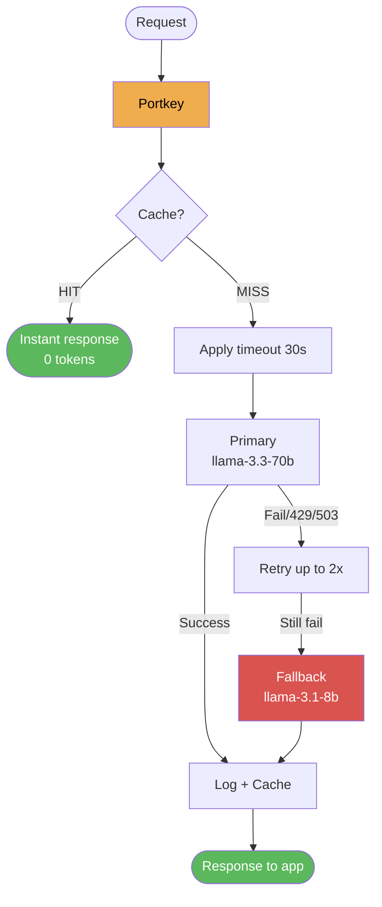

---

## Integrating the Gateway into the RAG API

In our FastAPI backend, the gateway wraps the LLM before it reaches LangGraph:

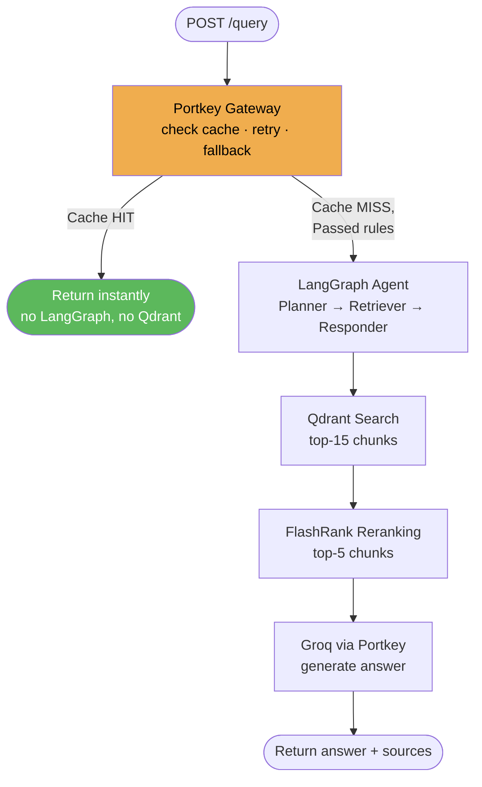

```python
# app/main.py
from portkey_ai import Portkey, createHeaders, PORTKEY_GATEWAY_URL
from langchain_openai import ChatOpenAI

gateway_llm = ChatOpenAI(
    api_key=PORTKEY_API_KEY,
    base_url=PORTKEY_GATEWAY_URL,
    model="@flight-policsy/llama-3.3-70b-versatile",
    default_headers=createHeaders(
        api_key=PORTKEY_API_KEY,
        config=PRODUCTION_CONFIG,
        metadata={"feature": "rag-query"}
    )
)
```

---

## Gateway vs Guardrails — What's the Difference?

These two work at different layers and do different jobs:

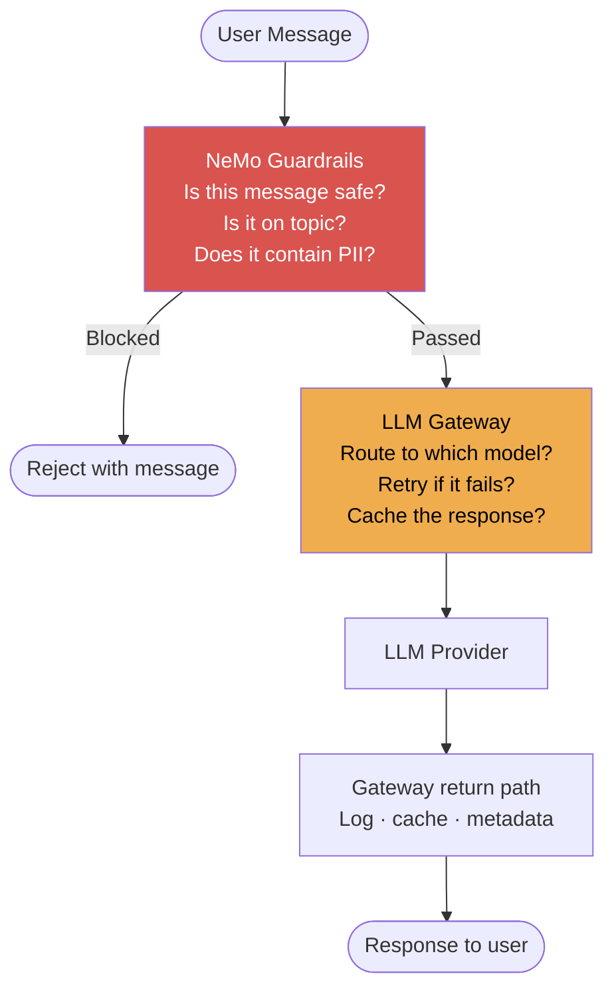

|  | Guardrails | Gateway |
| --- | --- | --- |
| **Asks** | *Should this request happen at all?* | *How should this request be sent?* |
| **Layer** | Before the LLM pipeline | Around every LLM call |
| **Blocks** | Jailbreaks, off-topic, PII | Nothing — routes and retries |
| **Tool** | NeMo Guardrails (Colang) | Portkey |

Use both together: guardrails at the gate, gateway for everything that passes through.

---

## Framework Comparison

| Framework | Type | Dashboard | Fallbacks | Caching | Best For |
| --- | --- | --- | --- | --- | --- |
| **Portkey** | Managed proxy + SDK | ✅ Beautiful | ✅ | ✅ | Enterprise observability + configs |
| **LiteLLM** | Python library | ⚠️ Basic | ✅ | ✅ | Pure code, no dashboard needed |
| **Azure AI Gateway** | Azure managed | ✅ Azure Portal | ✅ | ✅ | Azure-native workloads |
| **AWS Bedrock** | AWS managed | ✅ CloudWatch | ✅ | ✅ | AWS-native workloads |
| **Direct SDK** | No proxy | ❌ None | ❌ Manual | ❌ Manual | Prototyping only |

**Why Portkey for this system:**

- LLM-agnostic — Groq today, any provider tomorrow, no code changes
- Dashboard built for debugging RAG systems (full prompt + response logs)
- Config-as-JSON means routing rules can change without redeploy
- LangChain drop-in keeps all existing node code untouched
- Open source (Apache 2.0), runs as self-hosted or managed

---

## Terminology Reference

> Every term you will encounter in the experiments, explained in plain English. Use this as your lookup dictionary.

---

### General LLM Terms

| Term | Plain-English Definition |
|------|--------------------------|
| **LLM** | Large Language Model — an AI model trained on text that can understand and generate human language. Examples: GPT-4, Claude, Llama, Gemini. |
| **Inference** | The act of running an LLM to get an answer. When you "call" a model, you are doing inference. |
| **Token** | The unit the LLM reads and writes in. A token ≈ 0.75 words in English. "Hello world" = 2 tokens. Every API call costs money based on token count. |
| **Input tokens** | Tokens in the message you send — your prompt, system instructions, and conversation history. |
| **Output tokens** | Tokens the model generates in its reply. These cost more than input tokens on most providers. |
| **Prompt** | The text you send to the model as input. Can include a system message (instructions) and a user message (the question). |
| **System message** | An instruction given to the model before the conversation starts. Tells it its role, tone, or constraints. |
| **User message** | The actual question or request from the human in the conversation. |
| **Completion** | The model's generated response. Also called "output" or "response". |
| **Context window** | The maximum number of tokens the model can "see" at once — your prompt + its response must fit inside this limit. |
| **Temperature** | Controls randomness in the model's output. 0.0 = deterministic/consistent. 1.0 = creative/varied. |
| **max_tokens** | The cap you set on how long the model's response can be. The model stops after this many output tokens. |
| **Streaming** | Instead of waiting for the full response, tokens are sent back to your app as they are generated — like reading text as it's typed. |
| **Chat completions** | The standard API format for conversational AI. You send a list of `{"role": ..., "content": ...}` messages and get a response. This is the OpenAI API format that almost all modern providers adopted. |
| **OpenAI-compatible API** | An API that follows the same format as OpenAI's API. Groq, Anthropic (partially), and many others support it — meaning you can use the same SDK to talk to all of them. |
| **SDK** | Software Development Kit — a library that wraps an API so you can call it from Python without writing raw HTTP requests. |
| **API key** | A secret string that identifies you to a provider. Every call must include one. Never share or commit it to git. |
| **Base URL / Endpoint** | The web address your SDK sends requests to. OpenAI's default is `https://api.openai.com/v1`. Groq's is `https://api.groq.com/openai/v1`. Portkey's is `https://api.portkey.ai/v1`. |
| **Rate limit** | A cap enforced by the provider on how many requests (or tokens) you can send per minute. Exceeding it returns HTTP 429. |
| **Latency** | How long a request takes from send to response, measured in milliseconds (ms). A key performance metric for user-facing apps. |

---

### Gateway & Architecture Terms

| Term | Plain-English Definition |
|------|--------------------------|
| **LLM Gateway** | A proxy layer that sits between your app and LLM providers. All calls go through it, giving you retry, fallback, caching, routing, and logging in one place. |
| **Proxy** | A middleman server that forwards your request to the real destination and returns the reply. Your app talks to the proxy; the proxy talks to the LLM. |
| **Middleware** | Code that runs between two systems. A gateway is middleware between your app and the LLM. |
| **Observability** | The ability to see what your system is doing — logs, costs, latency, errors. Without it you are flying blind. |
| **Audit trail** | A complete record of every request: who sent it, what was in it, which model answered, how much it cost. |
| **Retry** | Automatically sending a failed request again. Used when errors are transient (temporary), like a momentary rate limit. |
| **Exponential backoff** | A retry strategy where you wait longer between each attempt: wait 1s → wait 2s → wait 4s. Prevents hammering a struggling provider. |
| **Timeout** | A hard time limit you set on a request. If the model doesn't respond in that time, the gateway cancels the request and returns an error. Prevents your app from hanging forever. |
| **Fallback** | When the primary model fails, automatically switch to a backup model and retry with that instead. The user never sees the failure. |
| **Load balancing** | Spreading traffic across multiple models or API keys. Instead of sending everything to one model, split it — 70% here, 30% there. |
| **Cache** | A store of previous responses. If the exact same request comes in again, return the stored answer instantly instead of calling the LLM again. Saves money and reduces latency. |
| **Cache hit** | The incoming request matched something in the cache. Response returned instantly at zero LLM cost. |
| **Cache miss** | No match in cache. The request goes to the LLM, gets a response, and that response is stored for future hits. |
| **Semantic cache** | A smarter cache that matches requests by *meaning* rather than exact characters. "What is RAG?" and "Can you explain RAG?" both hit the same cache entry. Portkey Enterprise only. |
| **Metadata / Tags** | Key-value labels you attach to each request (`_user`, `feature`, `session_id`). Used to filter and group logs in the dashboard for per-user and per-feature analytics. |
| **Throughput** | How many requests per second your system can handle. Load balancing and caching both improve throughput. |
| **Provider** | A company offering LLM access via API: Groq, OpenAI, Anthropic, Google (Gemini), NVIDIA, Cohere, etc. |

---

### Portkey-Specific Terms

| Term | Plain-English Definition |
|------|--------------------------|
| **Portkey API key** | Your personal key to authenticate with Portkey itself (starts with `pk-...`). This is NOT the same as your Groq/OpenAI key. |
| **Virtual Key** | A Portkey-managed credential that wraps your real provider API key. You create it in the Portkey dashboard. Your code uses the virtual key; Portkey uses the real key behind the scenes. Enables key rotation and per-team access without touching code. |
| **Provider Slug** | The short name you gave a virtual key when you added a provider in the Portkey dashboard. Example: `flight-policsy`. Used as `@flight-policsy/model-name` in your model parameter. |
| **`@slug/model` notation** | The Portkey way of specifying which provider + model to use. `@flight-policsy/llama-3.3-70b-versatile` means "use the provider registered under slug `flight-policsy` with model `llama-3.3-70b-versatile`". |
| **Config** | A JSON object that tells Portkey how to handle requests — which retry rules, timeouts, fallback order, caching mode, etc. Can be passed inline as a dict or saved in the dashboard. |
| **Config ID** | A saved config in the Portkey dashboard, given a unique ID like `pc-ssss-d8a1e4`. Pass this string instead of the full dict. Lets you update routing rules from the dashboard without redeploying code. |
| **Strategy** | The routing mode. `"fallback"` = try primary, then backup on failure. `"loadbalance"` = split traffic by weight across targets. |
| **Target** | One entry in the `targets` list in a config. Each target points to a provider+model combination via its virtual key and `override_params`. |
| **override_params** | Inside a target, the model and any other params to use for that specific provider. Lets different targets in the same config use different models. |
| **Weight** | A number between 0 and 1 in load-balancing mode. `weight: 0.7` means 70% of traffic goes to this target. All weights in a config must sum to 1.0. |
| **`request_timeout`** | The hard time limit (in milliseconds) per request attempt. Portkey returns HTTP 408 if the LLM doesn't respond within this window. |
| **`retry.attempts`** | How many total tries Portkey will make on a failing request before giving up or moving to fallback. |
| **`retry.on_status_codes`** | The list of HTTP error codes that should trigger a retry. Typically `[429, 500, 502, 503]`. |
| **`cache.mode: "simple"`** | Exact-match caching. The request must be byte-for-byte identical (same model + same messages) to get a cache hit. |
| **`cache.mode: "semantic"`** | Meaning-based caching. Similar questions share cache entries even if worded differently. Enterprise plan only. |
| **`cache_force_refresh`** | A per-request override to skip the cache and call the LLM fresh. Use `portkey.with_options(cache_force_refresh=True)`. Useful after updating knowledge bases. |
| **`with_options()`** | A method to override config settings for a single request without changing the main client. Used for metadata and cache overrides. |
| **`PORTKEY_GATEWAY_URL`** | The constant `https://api.portkey.ai/v1` — the base URL for Portkey's proxy. Used when wiring Portkey into LangChain via `ChatOpenAI(base_url=PORTKEY_GATEWAY_URL)`. |
| **`createHeaders()`** | A Portkey helper that builds the authentication headers needed when using LangChain's `ChatOpenAI` with Portkey. Packages your Portkey key, config, and metadata into the right HTTP headers. |
| **Portkey Dashboard** | The web UI at `app.portkey.ai`. Where you create virtual keys, save configs, and browse logs. |

---

### HTTP Status Codes

These are standard web error codes you will see throughout the experiments:

| Code | Name | Meaning in LLM context |
|------|------|------------------------|
| **200** | OK | Request succeeded. Model responded normally. |
| **400** | Bad Request | Your request was malformed — wrong JSON, missing required field, invalid model name. |
| **401** | Unauthorized | Invalid or missing API key. |
| **403** | Forbidden | Your key is valid but doesn't have permission for this operation. |
| **404** | Not Found | The model or endpoint you requested doesn't exist. |
| **408** | Request Timeout | The model took longer than your configured timeout. Portkey fires this itself when `request_timeout` is exceeded. |
| **422** | Unprocessable Entity | The request structure is correct but the values are invalid (e.g. temperature outside allowed range). |
| **429** | Too Many Requests | You've hit the provider's rate limit. Back off and retry. Most retries are configured to trigger on this code. |
| **500** | Internal Server Error | The provider's server crashed or had an unexpected error. Not your fault — retry usually helps. |
| **502** | Bad Gateway | A proxy or upstream server failed. Transient — retry usually resolves it. |
| **503** | Service Unavailable | The provider is temporarily down or overloaded. Retry with backoff. |
| **504** | Gateway Timeout | The provider took too long from Portkey's perspective. Similar to 408 but from upstream. |

---

### LangChain + Portkey Terms

| Term | Plain-English Definition |
|------|--------------------------|
| **LangChain** | A Python framework for building LLM-powered apps. Provides chains, agents, retrievers, memory, and tool-calling abstractions. |
| **LCEL** | LangChain Expression Language — the `\|` pipe syntax for chaining components: `prompt \| llm \| parser`. Each component's output is the next component's input. |
| **ChatOpenAI** | A LangChain LLM wrapper that speaks the OpenAI API format. Used with Portkey because Portkey is OpenAI-compatible — you point `base_url` at Portkey instead of OpenAI. |
| **ChatGroq** | A LangChain LLM wrapper with Groq's URL hardcoded. Cannot be redirected to Portkey — that's why `ChatOpenAI` is used instead. |
| **ChatPromptTemplate** | A LangChain class that defines a reusable message template with variable placeholders like `{question}`. |
| **StrOutputParser** | A LangChain component that extracts the plain text string from an LLM response object. |
| **default_headers** | Extra HTTP headers passed with every LangChain call. Used to pass Portkey's auth and config when using `ChatOpenAI` as a proxy client. |
| **LangGraph** | LangChain's framework for building stateful AI agents as graphs (nodes + edges). Each node can use a Portkey-wrapped LLM without changing node logic. |
| **RAG** | Retrieval-Augmented Generation — a pattern where relevant documents are retrieved from a database and injected into the prompt before calling the LLM. The gateway sits around the LLM call, not the retrieval step. |

---

## Quick Reference — Config Keys

| Key | What it does | Example value |
| --- | --- | --- |
| `strategy.mode` | Routing strategy | `"fallback"` / `"loadbalance"` |
| `strategy.on_status_codes` | Narrow fallback trigger | `[429, 503]` |
| `retry.attempts` | Max retry count | `3` |
| `retry.on_status_codes` | Which errors trigger retry | `[429, 500, 502, 503, 504]` |
| `request_timeout` | Hard time limit in ms | `10000` (10 seconds) |
| `cache.mode` | Caching strategy | `"simple"` / `"semantic"` |
| `targets[].override_params.model` | Model for this target | `"@slug/model-name"` |
| `targets[].weight` | Load balance weight | `0.7` (70%) |

## Quick Reference — Python API

| Method | What it does |
| --- | --- |
| `Portkey(api_key=..., config={...})` | Client with inline config |
| `Portkey(api_key=..., config="pc-...")` | Client with saved dashboard config |
| `portkey.chat.completions.create(model="@slug/model", ...)` | Standard LLM call via gateway |
| `portkey.with_options(metadata={...})` | Override options for one request |
| `portkey.with_options(cache_force_refresh=True)` | Bypass cache for this request |
| `createHeaders(api_key=..., metadata={...})` | Build headers for LangChain integration |
| `PORTKEY_GATEWAY_URL` | `https://api.portkey.ai/v1` — the proxy endpoint |

---
